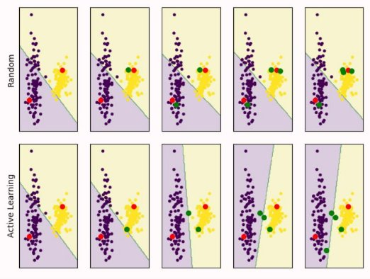
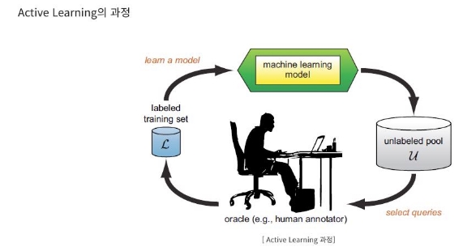

Basic of Active Learning

**Active Learning**의** 배경

1\. Deep Learning은 매우 좋은 성능을 보이지만, 많은 Labeling 비용이 필요하다 But.. 많은 데이터는 거의 항상(Almost always) 성능이 좋아진다.

1. 많은 데이터 → 높은 표현력(Higher representative power) → 더 좋은 성능
1. 하지만, 많은 데이터 → 많은 Labeling 비용

**Active Learning**의** 개요

1\. 전체 데이터셋중에서 중요한 데이터를 선별함으로써, 충분한 모델 경쟁력을 가지자란 의의

Active Learning : 과정 및 효과

- 빨간점 : labeling 된 데이터
  - 초록점 : 레이블링을 위해, 선택된 데이터

일반적인 Random Sampling 방식보다, Active learning을 통해서 중요 데이터를 찾고, 모델을 학습했을 경우, 보라색 그룹과 노란색 그룹을 잘 나누는 경계선(Decision Boundary)을 더 빠르게 더 잘 찾아진다.

1. Learn a Model : 레이블링 된 데이터(*L*)를 활용하여, 모델 학습
1. Select Queries : 학습된 모델을 통해서, 레이블링 되지 않은 데이터(*U*)에서 선별
1. Human Annotator : 사람이 레이블링 
1. Training set : 새로 레이블링 된 데이터를 기존 dataset과 합친다.
1. 목표 성능 도달까지 위에 과정(1~4)을 반복한다.

Active Learning은 크게 세 분야로 나누어진다.

- **Membership Query Synthesis** : 모델이 레이블링 요청(Query)할 데이터를  생성
- 데이터 생성은 매우 어렵기 때문에 현재는 관심 없는 분야 
  - Stream-based Selective Sampling
- 새로운 샘플이 들어옴 → 모델이 레이블링 필요한지 아닌지를 판단

(ex : Binary Model)

3. Pool-based Sampling
- 큰 데이터 Pool이 존재 → 모델이 중요한 데이터 포인트(data point - query)를 선택
- 사실 위에 세 가지 분류는 중요하지 않다. Active Learning이라 하면 대부분 Pool-based 방식을 의미
  - 현재, 데이터는 넘친다. 다만, 정제가 되지 않아서 문제다. → 현재 대표적인 **Active Learning **방안

AL 동작 스탭 1. 데이터 수집

1. 실제 데이터의 분포를 반영하도록 데이터셋을 수집
   1. 이때 수집 되는 데이터는 라벨링되지 않은 데이터셋
2. 데이터셋 분할
   1. 모델 학습에 사용할 시드 데이터(= 라벨링 된 데이터)와 라벨링 되지 않은 데이터로 나눈다
      1. 1에서 수집 된 데이터중 일부는 라벨링이 이루어지고 나머지는 라벨링 되지 않은 상태로 남겨둔다.
3. 라벨링
   1. query strategy를 이용해 추가적으로 라벨링이 필요한 데이터를 선택한다.
3. 학습 중단 기준 마련
- 이제 어떤 기준에 만족할 때까지 Step 2~3을 반복하며 모델을 고도화하게 된다.
  - 예를 들어, test 데이터를 미리 나누어 두고, 이 테스트 데이터에 대한 성능이 나아지지 않으면 과정을 중단하게 한다.
