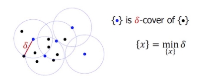
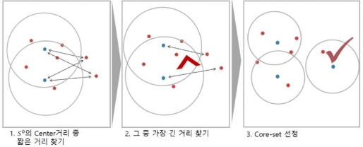
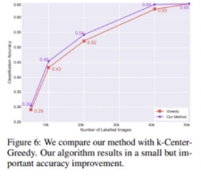

Core-Set Algorithm

 Unlabeled 된 데이터 전체를 Cover 할 수 있는 Core-Set을 찾는 것이 목표

- 2가지 알고리즘
  - K-Center-Greedy

    

- **Choose b center points such that the largest distance between a data point and its nearest center is minimized. ** = 데이터 포인트X0 와 Subset S0 중심들 간의 거리 중 가장 큰 거리를 최소로 만드는 b를 선택한다.
  - 도식화

K-Center-Greedy 알고리즘 도식화

![ref1] 장점

- 구현이 간단하다
  - 탐색 시간이 낮아 효율적  단점
    - Outlier에 취약 
- Robust K-Center
  - 알고리즘의 단점을 보완하기 위해 사용
    - 이상치를 고려
      - 몇 가지 제한사항과 Lower Bound를 추가
        - 모든 data point들은 하나의 center에게 커버되어야 한다.
          - 초기 Lower bound는 Upper bound의 1/2  초기 Upper bound는 maxjminj∈SgΔ(xi,xj)  이다.  Feasible 조건 만족 시, UB를 낮춤  Feasible 조건 불만족 시, LB를 낮춤
    - UB와 LB가 같을 때 ( 최적의  δs )까지 반복
- 장점
  - Outlier에 견고하다( Robust)
    - 최적의 Core-Set을 탐색한다. ![ref1] 단점
      - 구현이 매우 어렵다(Mixed Integer Program(MIP)를 사용해야 한다.)
        - MIP -> TSP 알고리즘과 유사
        - 탐색 시간이 K-Center-Greedy 대비 약 122배 오래 걸린다

K-Center-Greedy vs Robust

의문점 

 AL은 편차가 발생하기 때문에 반복 실험을 진행한다고 하는데 동일한 데이터가 뽑히는게 아닐까? ( 저번 발표 때 승희님이 말씀하셨던 내 용)

**hz : 1732 / bz : 448 / chem : 330 / yd : 169 **

**Cycle 4 Cycle 5**

Trial 1

Trial 2

` `![ref2]![ref3]

||||
| :- | :- | :- |

Trial 3

` `![ref2]![ref3]

||||
| :- | :- | :- |

Trial 4

` `![ref2]![ref3]

||||
| :- | :- | :- |

Trial 5

` `![ref2]![ref3]

[ref1]: assets/Aspose.Words.744aaedf-72ba-4360-b9ff-2432cb859a8f.006.png
[ref2]: assets/Aspose.Words.744aaedf-72ba-4360-b9ff-2432cb859a8f.021.png
[ref3]: assets/Aspose.Words.744aaedf-72ba-4360-b9ff-2432cb859a8f.022.png
