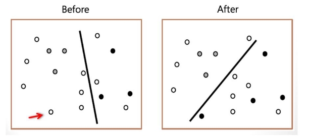
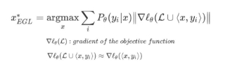

Expected Model Change

 새로운 데이터를 라벨링 해주었을 때 현재 모델을 가장 크게 변경시키는 데이터부터 선택

- 이를 위해 Expected Gradient Length(EGL)을 이용
  - 이론적으로 Gradient를 사용하는 모든 모델에 적용 가능

    

x 데이터가 주어졌을 때 yi 클래스에 속할 확률이 최대가 되는 x를 

찾는 것. 

x는 새로운 데이터 포인트가 되고 기존에 있던 데이터 포인트의 로 스와의 합집합을 그래디언트로 구하는데 이전 그래디언트는 0으로 가까워 지기 때문에 새로운 데이터에 대한 그래디언트 값으로 근사 

가능

장점 

1\. EGL 방식이 모델의 분산을 줄이는것을 증명

단점 

1\. RNN(Speech)에 한정적인 성능을 보일 수 있음( 논문 저자는 몇가지 처리를 추가했음)

→ 다른 실험들에서의 EGL의 성능이 낮게 나왔으며, Uncertainty와 Gradient의 크기 간의 무상관을 원인으로 꼽고 있다.
