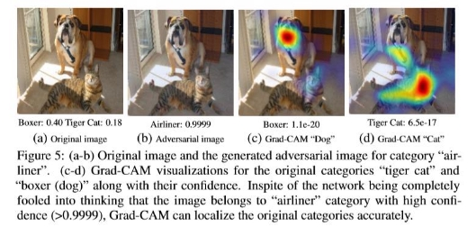

Grad-CAM - Visual Explanations from Deep Networks via Gradient-based Localization

- [Abstract](#_page0_x57.38_y435.60)
  - [Introduction ](#_page1_x57.38_y36.00) [Related Work ](#_page2_x57.38_y36.00) [Approach ](#_page2_x57.38_y222.31) [Grad-CAM generalizes CAM ](#_page3_x57.38_y145.44) [Guided Grad-CAM ](#_page3_x57.38_y178.02) [Counterfactual Explanations](#_page3_x57.38_y210.60)
  - [Evaluating Localization ](#_page3_x57.38_y545.04) [Weakly-supervised Localization ](#_page4_x57.38_y36.00) [Weakly-supvervised Segmentation ](#_page5_x57.38_y165.30) [Pointing game](#_page5_x57.38_y401.49)
  - [Evaluating Visualizations ](#_page5_x57.38_y458.50) [Evaluating Class Discrimination ](#_page5_x57.38_y513.48) [Evaluating Trust ](#_page6_x57.38_y36.00) [Faithfulness vs Interpretability](#_page6_x57.38_y108.28)
  - [Diagnosing image Classification CNNs ](#_page6_x57.38_y206.02) [A. Analyzing Failure Modes for VGG-16 ](#_page6_x57.38_y240.63) [B. Effect of adversarial noise on VGG-16(VGG-16에 있는 대립 노이즈의 영향) ](#_page6_x57.38_y575.07) [C. Identifying bias in dataset(데이터셋의 편향 찾기) ](#_page6_x57.38_y690.62) [Effect of adversarial noise on VGG-16 ](#_page7_x57.38_y244.20) [Identifying bias in dataset](#_page7_x57.38_y477.85)
  - [Counterfactual Explanations](#_page7_x57.38_y515.01)
  - [Image Captioning and VQA](#_page8_x57.38_y341.42)
    - [Conclusion](#_page8_x57.38_y579.14)
      - [Reference](#_page9_x57.38_y36.00)

Abstract 

CAM(Class Activation Mapping)은 CNN 기반 네트워크에서 많은 클래스를 결정할 때, 시각적인 설명을 제공한다. 여기서 말하는 Grad-CAM(Gradient-weighted CAM)은 CAM을 구할 때,

"예측 이미지 내 중요한 부분을 강조하는 대략적인 지역 맵을 생산하기위한 마지막 컨볼루션 층으로 흘러가는", "타겟 클래스(캡션, 마스크도 가능)에 대한" **gradient**를 이용한다.

따라서 적용할 수 있는 범위가 넓어졌다.

1. Fully-Connected 층이 있는 CNN (=VGG)
1. 구성된 output을 사용하는 CNN(=Captioning)
1. multimodal inputs 이 있는 CNN (VQA) 또는 강화학습

본 논문은 Grad-CAM의 이점을 5가지로 설명하였다.

1. 예측이 왜 다르게 나왔는지 설명을 해줄 수 있다.
1. 적대적 이미지(adversarial example)에 대해서도 적용이 잘 된다.
1. 이전 Baseline 모델들의 성능을 뛰어넘는다.
1. 근본적인 모델에 대해 좀 더 신뢰할만하다.
1. 데이터셋의 bias를 동일하게 하여(identifying) 모델 일반화를 달성한다.

Introduction 

CNN의 한계

1. 딥 뉴럴 네트워크는 강력하지만, 그에 비해 사용자가 이해하기에는 어려움
   1. 시스템 고장의 경우에도 설명이나 해석이 어려움
1. Interpretability matters(대화 능력의 문제)
   1. 시스템에 대한 신뢰를 쌓기 위해, 왜 그런 선택을 했는지 설명하는 '투명(Transparent)' 모델을 필요로 함
      1. 인공지능에서의 유용성
1. 아직 신뢰성을 확인할 수 없는 약-인공지능에서는 투명성과 설명을 통해 실패를 판정할 수 있음
1. 인공지능이 인간과 동등한 경우에는 이용자에 대한 적절한 신뢰 구축 가능
1. 인공지능이 인간보다 강할 때, 더 나은 방법을 인간에게 가르치기 가능
- Accuracy & simplicity or interpretability tradeoff(정확도와 단순성, 대화 능력의 트레이드 오프)
  - 규칙 기반 고전 시스템

 충분히 해석 가능하지만, 정확도 면에서 떨어짐

 각 단계를 손으로 설정하고, 외부의 변수 등을 미리 예측하기 때문에 추측이 쉬운 것으로 추측

- ResNet 같은 심층 모델  200개 이상의 레이어 깊이로 성능은 최첨단이지만 해석은 어려움
  - 이 연구에서 한 일
    - 최첨단 심층 모델의 아키텍처를 변경하지 않고 설명을 제공

 CAM의 일반화로 접근

1. 완전히 연결된 층(Fully-connected 레이어, ex: VGG)
1. 구조 출력에 사용되는 CNN(ex: 캡션)
1. 다중 모달 입력(ex:VQA) 또는 강화 학습에 사용하는 CNN 모델에도 사용 가능

B. What makes a good visual explanation?(좋은 시각적 설명이란?)

- 세분화된 구분(이미지의 대상 범주를 지역에 표현)
  - 고 해상도(세부 정보를 세밀하게 포착)

Related Work 

1. Visualizaing CNNs
1. CNN 예측기가 중요한 픽셀을 하이라이팅 하게 함
1. 네트워크 장치를 최대로 활성화 시키거나 잠재한 재설정을 반전시키기 위해 이미지를 합성
2. Assessing Model Trust
1. 대화 가능성의 개념
1. 모델에 대한 신뢰 보장
3. Aligning Gradient-based Importances
3. Weakly-Supervised Localization

Approach 

- Convolutional feature에서 기대할 수 있는 것
  - 더 깊은 표현으로 더 높은 수준의 시각적 구조 포착
    - Fully-connected 레이어에서 손실된 공간 정보를 포함하므로 마지막 Convolutional 레이어에서 높은 수준의 정보와 의미를 담고 있음을 기대
      - Grad-CAM에서는 마지막 Convolutional 레이어에서 각각의 뉴런의 선택이나 흥미를 이해할 수 있음

앞부분은 global average pooling이며, 뒷부분은 gradients(backpropagation)

- 가중치 a(ck)는 A에서부터 내려오는 심층 네트워크의 부분을 선형화한 것이며, k는 피쳐 맵에서의 중요한 c라는 클래스 부분을 포착한 것
  - Forward activation map의 가중치 조합을 활성화 후, ReLU 함수를 적용하면:

- Convolution feature map의 사이즈와 동일한 heat map 생성(VGG와 AlexNet의 경우에는 14 \* 14 사이즈의 레이어 생성)
  - ReLU를 적용한 이유는 class c score(=Yc)을 증가시키는 positive influence가 있는 클래스만 보기 위함
    - 일반적으로 Yc는 CNN을 이용한 이미지 분류에 의해 생성된 클래스 별 스코어일 필요는 없음

**Grad-CAM generalizes CAM  Guided Grad-CAM Counterfactual Explanations **

컨볼루션 레이어의 특징 맵 A에 대한 yc(클래스 c에 대한 점수)의 기울기를 부정합니다.

이렇게 함으로써 다른 물체를 부각시킨다

Evaluating Localization 

얻어낸 Grad-CAM 이미지로 모델이 어디를 보고 예측하는지에 대한 정보를 얻을 수 있다. 추가로 label없이 물체의 위치를 알 수 있는 Weakly-supervised localization을 할 수 있게 된다.

**Weakly-supervised Localization ![ref1]**

**Weakly-supvervised Segmentation ![ref1]**

**Pointing game **

Evaluating Visualizations 

PASCAL VOC 2007로 pretrained된 VGG16모델과 AlexNet으로 실험 진행

**Evaluating Class Discrimination **

실제 Amazon Mechanical Turk팀이 한 평가지 Guided Grad-CAM은 사람이 물체를 판단하는 능력을 더 올려주었습니다.

**Evaluating Trust **

두가지 예측된 설명으로부터, 무엇이 더 좋은 설명인지 평가하고 싶었고, VGG-16과 AlexNet으로 mAP를 비교했다. VGG-16이 79.09 vs 69.20으로 더 reliable 하다

**Faithfulness vs Interpretability **

둘의 관계는 Trade-off관계로 faithfulness를 올리려면 interpretability가 낮아지게 된다. 하지만 Grad-CAM은 Model에 대하여 Faithful하고 Interpretability 하는지 증명했다.

Diagnosing image Classification CNNs 

1. **Analyzing Failure Modes for VGG-16 **

2. **Effect of adversarial noise on VGG-16(VGG-16**에** 있는** 대립** 노이즈의** 영향**) **
- 심층 네트워크의 취약성
  - 없는 레이블에 대해 높은 신뢰도를 갖게 함으로써 이미지를 잘 못 분류하게 만듬
  - Grad-CAM의 특징
    - 이미지에 높은 확률로 없는 레이블에 높은 신뢰도를 할당 후, 있는 레이블에 대해 낮은 신뢰도를 할당
      - 그럼에도 불구하고 Grad-CAM은 존재하지 않는 레이블임을 알고 있음에도 시각화의 범위를 정확히 지역화 할 수 있었음
3. **Identifying bias in dataset(**데이터셋의** 편향** 찾기**) **
- 데이터셋의 편향
  - 실제 존재하는 시나리오에 대해 일반화 되지는 않을 수 있음
    - 다만 현실에서 존재하는 편견과 고정관념에 대해 학습할 수 있음
- 분석 방법
  - ImageNet에서 훈련된 VGG-16 모델  의사와 간호사를 구별하게 함
    - 인기 있는 이미지 상위 250개를 트레이닝  트레이닝 모델은 상위 250개의 이미지에 대해서 높은 정확도 달성
    - Grad-CAM의 간호사/의사 구별 방법

 헤어 스타일 및 얼굴을 학습

 성별-편향적임

- 시각화를 통해 얻은 데이터를 통해 트레이닝 이미지 변경  균형 잡힌(90%) 상태로 잘 일반화
- 특징
  - Grad-CAM이 있으면 데이터의 편향을 확인할 수 있고, 트레이닝 세트를 수정할 수 있음

**Effect of adversarial noise on VGG-16 **

**Identifying bias in dataset **

Counterfactual Explanations 

저자는 네트워크의 결정을 바꾸는데 영향을 주는 지역을 강조하는 Counterfactual explanation이라는 새로운 해석 양식(Explanation modality)을 제안했다.

네트워크가 결정을 바꾸도록 하는 지역을 하이라이팅

 이 지역에서 발생하는 개념을 제거하면 더욱 명확한 결과를 얻을 수 있음

아래 그림을 보면 Cat을 찾아내기 위해 Dog를 배제한 모습을 볼 수 있다. Vice versa 마찬가지

방법은 위에서 정의한 neuron importance weights에서 뒤에 -를 붙여 새로운 양식을 만들었다.

Image Captioning and VQA 

저자는 Grad-CAM으로 많은 실험을 하였고, 그 중 마지막은 VQA였다.

위 사진은 모델이 무엇을 보고 이미지에 대한 대답을 해주는지 그 근거를 말해주고 있다.

Conclusion 

- Grad-CAM을 사용함으로써 시각적인 설명을 제공하고 모델을 좀 더 살펴볼 수 있다.
  - Grad-CAM을 통해 고해상도의 클래스를 구분하는 Guided Grad-CAM로 할 수 있게 되었다.
    - 만들어낸 시각화는 기존의 Weakly-Supervised Localization과 pointing, faithfulness 등 여러 성능을 뛰어 넘었다
      - AI 시스템은 지능 뿐만 아니라 사람이 신뢰할 수 있도록 근거가 필요한데 Grad-CAM은 이를 도와줄 것이다.

Reference 

- [Grad CAM 에 대한 이해 ](https://hygradcam.blogspot.com/2020/11/blog-post.html)
  - [2) CAM, Grad CAM ](https://wikidocs.net/135874)

[ref1]: assets/Aspose.Words.9cf1bb5c-dc9a-4f52-ae95-18276baa4e63.037.jpeg
