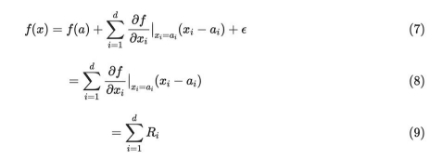
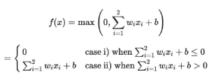

LRP(Layer-wise Relevance propagation)

- [Taylor Series](#_page0_x57.38_y160.71)
  - [테일러 급수 수식의 적절한 변형](#_page0_x57.38_y715.57)
    - [ReLU의 특성을 통해 epsilon = 0 ](#_page1_x57.38_y243.69) [Reference](#_page1_x57.38_y648.37)

Taylor Series 

테일러 급수 or 테일러 전개는 어떤 미지의 함수 f(x)를 아래 식과 같이 근사** 다항함수로 표현 하는 것을 의미

- **x = a** 근처에서만** 성립하고** 근사다항식의** 차수는** 높을수록 **f(x)**를** 더** 잘** 근사할** 수** 있음
  - a가 0일 때는 맥클로린 급수

ex) 

sin(x\*\*2) 근사 식

다변수 함수의 경우에는 Taylor 급수는 다음과 같다.

즉, d 차원 input에 대해서는 1차원 테일러 급수를 쓸 수 있다고 한다.

테일러 급수 수식의 적절한 변형 

위 식에서 f(a)와  ϵ 불필요한 term이기 때문에 제거하는 편이 좋다.

- f(a)는 taylor series의 특성을 통해 f(a) = 0인 a를 수학적으로 찾고, 그 지점으로부터 함수를 근사함으로써 0으로 만들어 버릴 수 있고  ϵ 은 ReLU 활성화 함수의 특성을 이용해 0으로 만들어 버릴 수 있다.
  - 그렇게 한다면 출력 f(x)는 relevance score만으로 분해가능하다.

` `

ReLU의 특성을 통해 epsilon = 0 

입력 2개와 출력 하나를 갖고, 활성화 함수가 ReLU

위 식을 테일러 급수로 나타내면 

여기서 f(x)를 w1\*x1 + w2\*x2 + b로 나타낼 수 있는데 이를 미분하면 w1과 w2로 나타낼 수 있고 편미분 계수는 모두 0이다.

따라서, 식 (12)에서 Taylor Series로 씌여진 식에서  ϵ=0 임을 알 수 있다. 그러므로 식을 다시 쓰면 아래와 같다.

**Reference **

- [\[3주차\]LRP(Layer-wise Relevance Propagation) ](https://velog.io/@tobigs_xai/3%EC%A3%BC%EC%B0%A8LRPLayer-wise-Relevance-Propagation)
  - [Layer-wise Relevance Propagation - 공돌이의 수학정리노트 (Angelo's Math Notes) ](https://angeloyeo.github.io/2019/08/17/Layerwise_Relevance_Propagation.html)
    - [테일러 급수의 이해와 활용 (Taylor series) ](https://darkpgmr.tistory.com/59)
