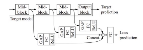
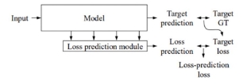
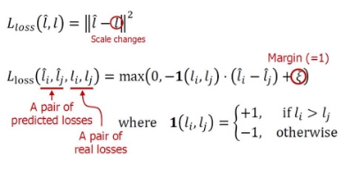
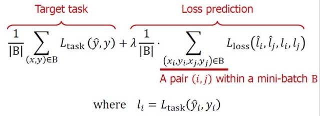
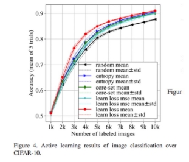
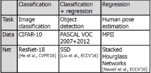

Learning Loss for AL

- Unlabeled 데이터 중 Loss가 가장 큰 데이터부터 선택
  - Loss prediction 모듈을 추가하여 Loss 예측 수행
    - Loss가 가장 클 것으로 예측 된 Top-K 개의 데이터에 대해 요청

 GAP을 통하여 모델 중간 Block들의 output을 압출

- Loss Prediction Module에서 각 Mid Block - GAP사이에 Conv를 추가해 보았으나, 성능향상은 없었음

- Loss값을 구하는 것으로 단순히 MSE Loss 값을 생각할 수 있다
  - 하지만 Target loss는 0으로 수렴하기 때문에 Scale이 변한다는 문제가 존재.

따라서 **MSE loss** 대신 **Margin Ranking Loss  **사용

 Margin에 1을 주어서 1이상 커져야만 패널티를 받지 않도록 구성

**Total Loss = Target Loss + Loss prediction Loss **

결과  

 

 기존 AL 방법 보다 높은 성능과 다양한 Task(ex) Regression )등에서 효과적으로 사용할 수 있음을 검증

한계점 

- Diversity와 Density는 고려되지 않았다.
  - 어려운 일일 수록 Loss Prediction Accuracy와의 연관성이 떨어진다.
- Loss Prediction Accuracy가 높을 수록 학습하기 좋은 데이터 라는 의미
