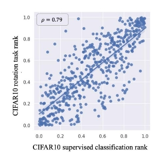
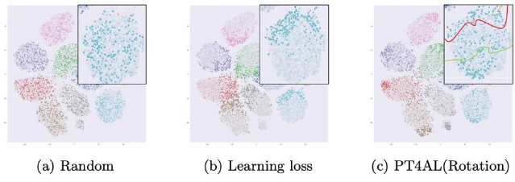
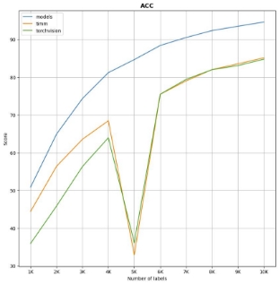
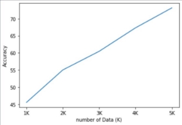
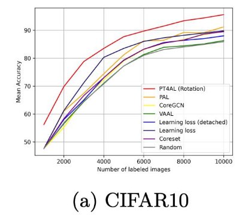

PT4AL( 19 Jan 2022 )

Using Self-Supervised Pretext Tasks for Active Learning 

1. Terminology  **Self-supervised learning ? **
- Two main existing AL approaches ==: **Distribution-based** and **Uncertainty-based**
  - Distribution-based = CoreSet, GCN etc..
    - Advantage
      - 클래스 분포를 고려하여 샘플링 한다.  Disadvantage
        - 모델이 어려워하는 데이터를 공부하지 않기 때문에 Train에 상대적으로 덜 도움된다.
    - Uncertainty-based = Learning Loss, BAAL etc..
      - Advantage
        - 어려운 데이터만 공부하기 때문에 Train에 매우 도움 된다
        - Disadvantage  데이터에 분포가 고려되지 않아 Imbalanced data로 학습하게 된다.

**PT4AL**은 **Uncertainty**와 **Distribution**의 **method**를** 합친** 방법 

2. Abstract  
- A novel AL selects data that are Both difficult and representative
  - Discover that the loss of a simple self-supervised pretext task is closely correlated to the downstream task loss
    - Perform well on imbalanced datasets and effective solution to the cold-start problem
3. Introduction 

![ref1]

PT4AL

 Pretext task Loss를 descending sort하고  BATCH 단위로 나눈다

- 여기서의 Batch는 Subset이라고 생각
- 배치단위로 나누는 것은 Data-distribution || Uncertainty-based sampler는 어려운 데이터를 뽑게 해준다

→ 미리 배치단위로 Train set을 정의해두었기 때문에 Initial step에서 유래된 Cold-start가 발생하지 않고 뿐만아니라 AL은 첫번째 dataset의 분포에 매우 의존성이 높은데 그 문제를 피할 수 있다.

**Representation Learning with Pretext Tasks **

- Representation learning은 unlabeled된 데이터로 pretext tasks를 learning하여 good pre-trained weights를 갖는 것을 목표로 한다.
  - 여기서 pre-trained weights는 적은량의 downstream task로도 좋은 perfomance를 얻을 수 있도록 fine-tuned 되어있다.
  - Representation learning method중 **rotation** 사용 
    - Rotation prediction [16], colorization [48], solving jigsaw puzzles [34], and SimSiam [9] 중 Classification에서 Rotation이 가장 성능이 잘 나오 고 Segmentation에서는 colorization이 잘나와서 Rotation 사용
    - 최근 발표되는 Representation learning은 same image로부터의 augmentation된 이미지들의 거리를 minimize하고 다른 이미지들의 augmentation image들로부터 떨어지기 위하여 **Contrasive learning**을 사용
      - 이 논문에서 Constrasive learning을 사용하지 않은 이유는 빠르고 간단한 AL모델을 만드려는 목적과 부합하지 않아서 사용하지 않았다고 한다.
        - Constrasive learning 사용 시 large batch size와 long training time이 일반적으로 필요
4. Using Pretext Tasks for AL 

**H1: Pretext task loss is correlated with the main task loss **

1 **if** ( Pretext task 가 main task와 관련 있거나 대표하는 것이라면 ): 2

3 **return** ( Pretext Task에서 어려운 image는 Main task에서도 어려울 것이다. )

 

- The x-axis is the normalized rank of the main task loss, and the y-axis is the normalized rank of the pretext task loss
  - Spearman’s rank correlation = 0.79
    - the pretext and main task losses have a strong positive correlation. That is, if a data sample has high loss for a pretext task, it is likely for it to have high loss for the main task, and vice versa.
5. Method 

![ref1]

PT4AL

크게 3가지로 분류 가능 

1. rotation.py
1. make\_batches.py
1. main.py

**rotation.py ( Pretext Task Learning for Batch Split ) **

- Pretext task learning 하는 파일
  - Rotation Pretext task는 input(x)에 대해 진짜 label(y)를 주어주지않고 rotation에 따른 라벨을 부여하고 그걸 train/test 하는 method
    - model이 4가지 방향에 대해 train하고 rotation prediction하는 method
    - The loss function is defined as the average of the losses for each orientation

output = rotation.pth

**make\_batches.py( Batch split ) **

- rotation에서 pretrained된 모델로 전체 데이터셋에 대해 loss를 예측하여 K개의 Batch로 split해주는 파일(descending = True)
  - Batch = The term batch refers to a pool of unlabeled data to be sampled in an AL iteration ( = subset )

Batch\_i distribution( i = 10 )

output : rotation\_loss.txt -> batch\_i.txt ( i = iter )

**main.py ( In-batch Sampling ) **

Sampling method가 3개 존재 ( Class distribution, Uncertainty, Entropy loss )

- 처음에는 훈련이 아예 되어있지 않기 때문에 batch\_0.txt 파일에서 even interval 하게 K개 sampling 후 Train
  - 2(= j ) 번째부터 i-th번째 까지는 j-1번째 모델의 weight를 load하고 batch\_i.txt파일에서 method에 따라 K개 sampling후 Train 반복

6\. Experiments 

t-SNE

Vivid points are sampled for labeling. Best viewed in color

- 실험결과 balanced dataset과 imbalanced dataset 모두 PT4AL이 high performance를 자랑했고 놀라운 점은**Imbalanced Dataset**에서는 **Data- distribution AL method(Core-set, CoreGCN )**가 **Uncertainty method(learning loss, VAAL )**보다** 더** 좋다는** 것을** 확인했다 **( GCN** 에서도** 동일 한** 결과** 도출 **)**
  - <https://arxiv.org/pdf/2006.10219.pdf> ( Sequential GCN )

처음 sampling Acc

core-set(Resnet18)

실제 재현(Resnet18)

Computational Overheads

- we can observe that PT4AL achieves the best performance while having on-par computational overheads with others. Core-Set [38] has similar computations as the random selection baseline.
  - 다른 것들(Random, lloss, etc.. )과 동등한 Computational overheads를 갖을 때 PT4AL이 best performance를 가진다 ( – > Computational Overheads의 의미 ..? )
  - Paper : <https://arxiv.org/pdf/2201.07459.pdf>
    - Code : [ johnsk95/PT4AL ](https://github.com/johnsk95/pt4al)

[ref1]: assets/Aspose.Words.b692e171-d8a5-41de-b662-257c63a85462.013.png
