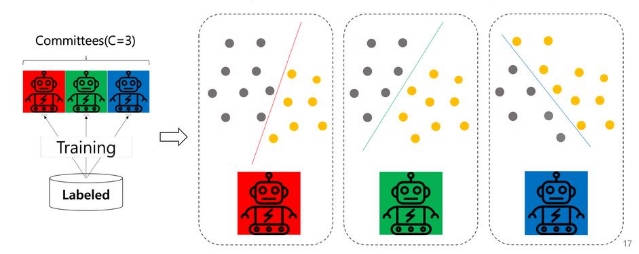
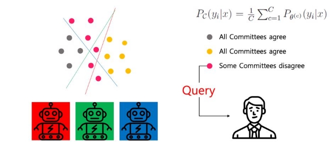

Query By Committee(QBC)

C개의 Committee(=Model)의 Disagreement 정도가 높은 데이터부터 선택

- 이유
  - 여러모델에서 추론한 결과가 다르다는 말은 불확실성이 높다고 추론 가능
    - 반대로 여러모델에서 동일한 결과가 나왔다면 확실성이 높다고 추론 가능

장점  

1. 구현이 어렵지 않다.
1. 앙상블도 좋고 이를 이용한 AL의 효과도 좋다.

단점 

1. 하나의 모델을 학습하는데 많은 비용이 드는 딥러닝에서는 사용이 어렵다.
1. (딥러닝 모델 학습 \* 앙상블모델 수 \* Active Learning 반복수) 를 생각해보면 AL의 자원 절감 효과가 줄어들 수 밖에 없다.
