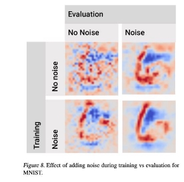

SmoothGrad: removing noise by adding noise

- [1. Introduction](#_page0_x57.38_y346.00)
  - [2. Gradients as sensitivity maps](#_page0_x57.38_y567.44)
    - [2.1 Previous work on enhancing sensitivity maps ](#_page1_x57.38_y202.96) [2.2 Smoothing noisy gradients](#_page1_x57.38_y659.57)
  - [3. Experiments](#_page2_x57.38_y576.60)
    - [3.1 Visualization methods and techniques ](#_page2_x57.38_y648.88)![ref1] [Absolute value of gradients ](#_page2_x57.38_y716.58) [Summary ](#_page3_x57.38_y104.72) [Capping outlying values(이상치 제한) ](#_page3_x57.38_y182.09) [Multiplying maps with the input images](#_page3_x57.38_y311.39)
      - [3.2 Effect of noise level and sample size ](#_page3_x57.38_y427.45) [Noise, σ ](#_page3_x57.38_y530.79) [Sample size, n ](#_page4_x57.38_y333.79) [3.3 Qualitative comparison to baseline methods ](#_page4_x57.38_y570.49) [3.4 Combining SmoothGrad with other methods ](#_page6_x57.38_y36.00) [3.5 Adding noise during training](#_page7_x57.38_y389.78)
  - [Conclusion and future work](#_page7_x57.38_y705.39)
    - [Question](#_page8_x57.38_y254.89)
      - [Reference](#_page8_x57.38_y354.66)
1. Introduction 
- 이미지 분류문제의 결과를 이해하기위해 일반적으로 사용하는 접근방식은 최종결과에 대해서 이미지의 어떤 부분이 영향을 미쳤는지 확 인하는 것이다.
  - 이런 접근방식은 sensitivity maps, saliency maps or pixel attribution maps 등 다양하게 불린다.
  - 이런 방법들은 얼굴의 눈과같이 사람이 이해할 수 있는 부분에 강조되어 보여지거나 종종 무작위로 선택되어 강조되기도 한다. 이런 노이 즈가 실제 결과에 의미가 있는 부분인건지 단지 피상적인 요인때문에 생긴 것인지는 알 수 없다. 이런 노이즈가 무엇이든간에 조사해볼 만하다.
    - 본 논문은 **Smooth Grad**라는 Very Simple technique를 소개한다.
      - visual noise를 줄이고 sensitivity map을 합치는 방법을 사용
      - 핵심 아이디어는 이미지에 noise를 추가하여 유사한 이미지를 샘플링한 다음, 각 샘플링된 이미지의 sensitivity map을 합쳐 평균하는 것입니 다.
        - 또한 이런 방법이 sensitivity map을 찾는데 ‘noise 제거(de-noising)’효과가 있음을 발견
        - 또한 two techniques(training with noise, and inferring with noise)를 사용 시 best results를 보여줌
2. Gradients as sensitivity maps 

이미지 분류 문제에서 하나의 이미지셋에서 클래스를 분류하는 것은 아래와 같은 수식으로 이해할 수 있다.

만약 S\_c가 구별이 가능하다면(piecewise differentiable) 입력 이미지 x에 대해서 sensitivity map M\_c(x)를 다음과 같이 간단하게 정의할 수 있다.

M\_c는 x의 각각의 픽셀들에 대한 작은 변화가 클래스 c에 대한 분류 점수와 얼마나 큰 차이가 있는지 만들어내는지 나타낸다. 그 결과로 M\_c는 핵심이 되는 부분을 강조하게 된다.

단순히 gradient로 나타낸 결과는 거칠 수 밖에 없음

noise가 매우 많다.

1. Previous work on enhancing sensitivity maps 
- gradient를 사용한 시각화 방법에 대한 노이즈에 대해서는 여러 가설이 존재 한다. 
  - 이미지에 아무렇게나 뿌려져 있는 것 같지만 이것이 의사결정에 중심적인 역할을 하고 있을 수 있다. 
    - 그러나 한편으로는 이것을 특성의 중요도에 대한 대안으로 사용하는 것이 최선이 아닐 수도 있다.
  - 기본 gradient sensitivity map에 대한 개선된 버전들이 제안되었고, 본 논문에서는 그 중 핵심들을 요약했다.
    - 영향을 측정하기 위해 기울기를 사용하는 것의 문제점 중 하나는 중요한 특징이 함수 Sc를 "포화"시킬 수 있다는 것입니다.
      - 반대로 전체적으로 강한 효과가 있다고 할 수 있고, 지역적으로 작은 효과를 가지기도 한다.  
      - **LRP, DeepLift, IG(Integrated Gradients)**와** 같이 **local sensitivity**보다** 각** 픽셀에** 대한** 전체적인** 중요도를** 측정하는** 것과** 같이** 잠재적인** 문제 들을** 해결하기** 위한** 연구들이** 있다**.** 
        - 이런 방법을 통해 만들어진 맵은 “saliency” 또는 “pixel attribution” 맵이라고 언급됐다.

Local sensitivity || Global sensitivity

- 역전파 방법 그자체를 결과에 대해 positive 부분을 강조하는 방향으로 바꾸는 연구도 존재한다. 
  - 역전파 과정에서 ReLU의 미분을 사용하여 negative 부분을 모두 버리는 것과 같은 Deconvolution[과 Guided Back](https://arxiv.org/abs/1311.2901)pr[opagation방법이 있다. ](https://arxiv.org/abs/1412.6806)
    - 연구의 목적은 high-level 단에서 feature를 보다 선명하게 보기 위함이다. 

**“Sensitivity map”, “Saliency map”, “pixel attribution map”**은** 서로** 다른** 용어이지만** 본** 논문에서는 **“Sensitivity maps”**로** 퉁침

2. Smoothing noisy gradients 
- sensitivity map에서 발생한 noise에 대해서 설명하자면 부분적으로 발생하는 의미없는 지역적 변화 때문일 것이다. 
  - 일반적인 훈련 방법으로는 이 noise를 제거할 수 없다.
    - 그리고 모델이 ReLU 함수를 사용하는한 S\_c 함수는 계속해서 미분을 할 수 없을수도 있다.
      - ReLU 활성화 함수는 입력값이 0이되면 기울기가 0이 되기 때문

- 왼쪽은 원본이미지 || 오른쪽은 원본 이미지에 평균이 0, 표준편차가 0.01인 노이즈를 더해준 이미지
  - t는 noise를 더한 정도이고, noise에 따른 이미지에 대한 gradient값이 어느정도 변화가 있었는지 RGB에 대해서 나타낸다. 결과적으로 사람 에게는 보이지 않을 정도의 차이지만 실제 gradient는 큰 변화가 있었음을 알 수있다
    - 이 결과를 통해서 새롭게 sensitivity maps을 만들 수 있는 방법을 고안하였다. 
      - gradient에 대한 sensitivity map을 만드는것이 아닌 가우시안** 커널을** 통해 **sensitivity map**을** 만드는** 것이다. 

sensitivity map Mc(x)

- **n**개의** 샘플** 갯수만큼** 이미지에** 대해서 **sensitivity map**을** 만들고** 그에** 대한** 평균을** 구한다**. **
  - 본 논문에서 제시하는 SMOOTHGRAD가 바로 이 방법을 뜻한다.

가우시안 커널이란 ?

데이터를 부드럽고 연속적인 함수로 모델링하는 데에 자주 사용되는 함수 중 하나입니다. 이 커널은 정규분포(Gaussian distribution)의 밀 도 함수와 관련이 있으며, 일반적으로 입력 데이터를 고차원 공간으로 매핑하는 데 사용됩니다.

가우시안 커널을 사용하여 sensitivity map을 만드는 경우, 커널의 크기와 표준 편차(sigma)를 설정한 후 입력 이미지에 커널을 적용하여 부 드러운 이미지를 만듭니다. 

이 부드러운 이미지를 사용하여 원래 이미지에서 작은 변화를 만들고, 이러한 변화가 출력값에 어떻게 영향을 미치는지 측정하여 sensitivity map을 생성합니다.

3. Experiments 
- SMOOTHGRAD에 대한 것을 평가하기위해 분류모델에 사용된 신경망 모델을 이용하였다. (inception v3)
  - 결과적으로는 unsmooth한 sensitivity map보다 본 논문에서 제시한 SMOOTHGRAD 방법이 더 좋았음을 시각적으로 확인할 수 있다.
1. Visualization methods and techniques 
- Sensitivity map은 일반적으로 히트맵 유형이고 영향력 있는 부분에 대해서 특정 색상으로 확인 할 수있다.
  - 이 챕터는 다양한 시각화 방법과 sensitivity map을 계산하는 과정에 대해서 확인한다.

**Absolute value of gradients **

 sensitivity map은 음수와 양수가 있는 signed values로 생성된다. 

- 그러나 음수와 양수를 함께 표현할지에 대한 여부는 데이터셋의 특성에 따라 나뉜다. 
  - MNIST의 경우 흑백이미지이기 때문에양수(positive) 부분에 대해서만 표현 할 수 있다. 
    - 하나의 공의 분류한다고 했을 때 만약 그 공이 어두운 공이고 밝은 배경이였다면 nagative gradient를 나타낼 것이고 그 반대라면 positive gradient를 나타낼 것이다.

**Summary **

- 다양한 색상을 가지고 있는 데이터셋(e.g ImageNet)은 다양한 색과 패턴을 가지고 있기 때문에, 부호 있는 값을 사용하면 시각화 결과가 혼 란스러울 수 있습니다. 
  - 따라서 이러한 경우에는 gradient의 절댓값을 사용하여 시각화하는 것이 더 명확한 결과를 얻을 수 있습니다.

**Capping outlying values(**이상치** 제한**) **

- gradient의 또 다른 특징은 평균보다 훨씬 더 높은 gradient를 가진 몇 개의 픽셀이 존재한다는 것이다. (이상치)
  - e.g. 극단적으로 높은 값을 갖는 이상치가 있다고 했을때 이상치에 대한 제거를 하지 않으면 전처리가 없이 sensitivity map을 그리게 되 면 대부분 어두운 값을 가지게 될 것이다.
    - 이것은 인간이 구별하기 어려운 Adversarial example을 생성하는데 활용되었었다.
  - 이것을 사용하면 시각적으로 일관된 맵을 만듭니다. 
    - 이러한 후처리 단계 없이 맵을 만들면 거의 완전히 검은 색으로 끝날 수 있습니다.

**Multiplying maps with the input images **

- 또 몇몇 방법은 gradient에 대한 값들을 곱하여 sensitivity map을 만들어내기도 한다. 
  - 보다 선명한 sensitivity map을 얻기 위함(명확한 특징을 잡는다고는 볼 수 없음)
  - 하지만 어느 픽셀값들이 0이라고 했을 때에 이 방법을 사용하면 sensitivity map을 얻기 힘들 것이다.
    - e.g 어느 분류기의 이미지가 0이라는 값으로 검정을 표현했을때, 하얀 배경에 있는 검정 공은 절대 검정공에 대해 표현될 수 없을 것이 다.
2. Effect of noise level and sample size 
- SmoothGrad는 2개의 하이퍼 파라미터를 가진다.
  - 가우시안 노이즈의 레벨 또는 표준 편차를 의미하는 σ
    - 평균화할 샘플의 수를 의미하는 n

**Noise, σ **

 시그마가 0 일때는 Vanilla method로 취급함

- 실험 결과 sensitivity map의 sharpness와 원래 이미지의 모양을 유지하는 것의 밸런스가 10%~20% noise때가 가장 좋았다.
  - map에 대해서는 정량적인 평가를 할 수 없기 때문에 사람이 판단할 수 밖에 없다.

**Sample size, n **

- Fig. 4 는 sample 수가 늘어남에 따라 gradient를 통한 sensitivity map의 결과가 점점 부드러워짐을 알 수 있다. 
  - n이 50보다 커지는 경우에는 미미한 차이만 존재
3. Qualitative comparison to baseline methods 
- sensitivity map을 정량적으로 평가할 수 있는 기준이 없기 때문에 이전에 연구되었던 연구를 기준으로 [정량적](https://arxiv.org/abs/1312.6034) 평가에 대한 두 가지 측면으 로 확인하였다.
  - 시각적인 요소
    - 하나의 이미지에 여러 물체가 있는 경우 이 물체들을 구분가능한 정도

- Guided Backpropagation은 배경과 물체의 색상이 다른 경우 Smoothgrad보다 좋은 성능을 보이지만 배경과 이미지가 하나의 색상을 나타낼 때는 성능이 나오지 않는다.
  - 반대로 SmoothGrad는 배경과 물체의 색상을 크게 영향받지 않고 꾸준히 좋은 성능을 보여주었다.
4. Combining SmoothGrad with other methods 

5. Adding noise during training 

` `

MNIST Model(tensorflow tutorial Model이라고 함) || Inception Model

Conclusion and future work 

 Gradient-based sensitivity map은 두 가지 형태의 스무딩으로 개선할 수 있다는 것을 말함.

- n\_samples 방법 
  - 주어진 이미지를 작은 변형으로 많이 만들어 낸 맵을 평균화하는 것이 상당한 스무딩 효과를 가지는 것으로 보인다.
  - train or test 시 random noise 추가
    - random noise을 입힌 데이터를 학습시키는 것으로 이 효과를 더욱 개선시킬 수 있다.
- Future Work
  - 본 논문에서는 noisy sensitivity map이 noisy gradient 때문에 발생되었다고 plausibility 추측을 하였는데 이것은 제대로 검증되지 않은 가 설이므로 disconfirm이나 support할 evidence가 필요하다고 한다.

![ref1] SMOOTHGRAD에 대한 효과가 다른이유에서가 아닌 다른 질감(texture) 때문일 수도 있다는 것이다.

- training 때 noise를 입히는 것보다 class score function을 좀 더 smooth 하게 해주는 방법이 있을 것이다.
  - survey paper와 마찬가지로 명확한 평가지표가 필요하다고 한다.

Question 

1. Train 혹은 Test time때 noise를 추가하면 sensitivity map에 denoising effect를 얻을 수 있다고 함
1. Train과 Test때 동시에 noise를 추가하면 보기에 가장 일관성있는 sensitivity map 생성 가능
1. Test time때에는 왜 그럴까 ? (Train때에도 noise를 추가했기 때문에 Test때에도 동일 환경을 맞춰줘서 그런가?)

실제 실험
   

Reference 

Paper: [SmoothGrad: removing noise by adding noise (arxiv.org)](https://arxiv.org/pdf/1706.03825.pdf)

[ref1]: assets/Aspose.Words.d1b856f9-28fb-4e5a-9ed6-88e00bd39e2a.002.png
