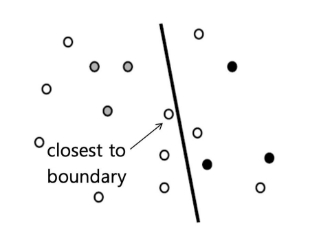
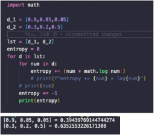
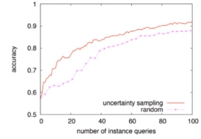

Uncertainty Sampling

- 초기 학습된 모델의 확신도가 가장 낮은 데이터부터 선별
  - Decision Boundary 근처에 있는 애매한 데이터들을 Query를 통해 확인하고자 하는 방법
    - 기본적으로 Top(Least) Confident, Margin Sampling, Entropy Sampling 3가지 전략이 주로 사용됩니다.

애매한 데이터 선별하는 Uncertainty Sampling

 3가지 전략

**Data A B C **D-1 0.9 0.05 0.05 D-2 0.3 0.5 0.2

1. Top(Least) Confident
- 모델이 예측한 각 클래스에 속할 확률 중 Top1 확률이 가장 낮은 데이터부터 선택
  - D-1의 Top Confident는 **0.9**, D-2의 Top Confident는 **0.5**
    - D-2가 D-1보다 작기 때문에 D-2를 선택

**Data A B C Top1 **D-1 0.9 0.05 0.05 0.9 D-2 0.3 0.5 0.2 0.5

2. Margin Sampling
- 모델이 예측한 각 클래스에 속할 확률 중 Top1, Top2의 차이가 가장 적은 데이터 부터 선택
  - D-1의 Margin = 0.85
    - D-2의 Margin = 0.2

 D-2의 Margin이 더 낮기 때문에 D-2를 선택

**Data A B C Top1-Top2 **D-1 0.9 0.05 0.05 0.85

D-2 0.3 0.5 0.2 0.2

3. Entropy Sampling

 모델이 예측한 각 클래스에 속할 확률을 활용해 엔트로피가 가장 큰 데이터부터 선택

**Data A B C Entropy **D-1 0.9 0.05 0.05 0.394 D-2 0.3 0.5 0.2 0.635

장점 

1. 구현하기 매우 쉬운편
1. 성능이 준수한 편
1. 딥러닝과의 연계도 생각보다 좋은 편

개 vs 고양이 데이터            random sampling보다 성능이 좋음

단점  

1. Outlier에 영향을 많이 받음
1. Diversity가 무시 됨
